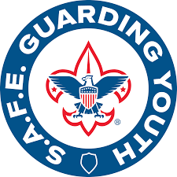

# Safeguarding Youth Training {-}

{fig-align="left" width=20%}

When: Required Every 1 year 

Who: ALL Scouting America new and registered volunteers aged 18+ 

Where: [Click here to take Safeguarding Youth Training](https://training.scouting.org/courses/SCO_3014) - Available Online ONLY

Alternatively navigate to training by:  

- Log in to: https://my.scouting.org/
- Click on My Training
- Click on ScoutsBSA
- Click on Catalog
- Click on Programs
- Type  'safeguarding youth' in the search bar

